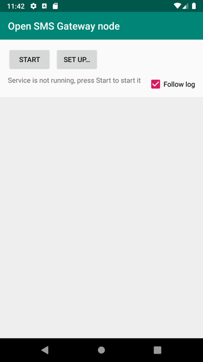
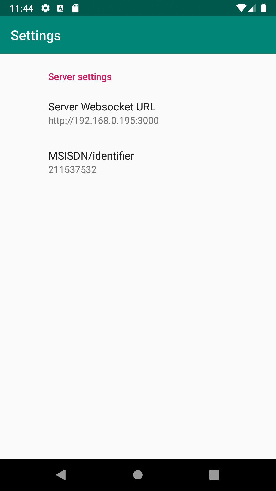
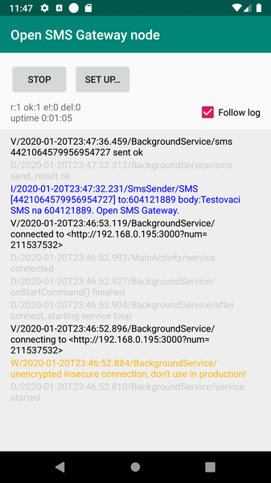

# Open SMS Gateway Android node
Application connects to the [server part](https://github.com/modularni-urad/open-sms-gateway) using WebSockets and receiving commands for sending SMSes from there. It is running as a service under Android.

# Usage
1. Install app from the APK
2. Launch the app

 

3. Press *Set up...*  to configure the URL of the backend server. Fill in a phone number to identify the client (it can be any 9-digits number).

   
   Example URL is in format **http://192.168.0.148:3000** (you should use HTTPs if it's in any untrusted network).

 
   
4. Return back to the main screen and press *Start*

 
5. App launches a service with notification in status bar. You may close the main activity now.

# Warning

There are not much yet any security measures supported yet. Like authentication to the backend server. 
